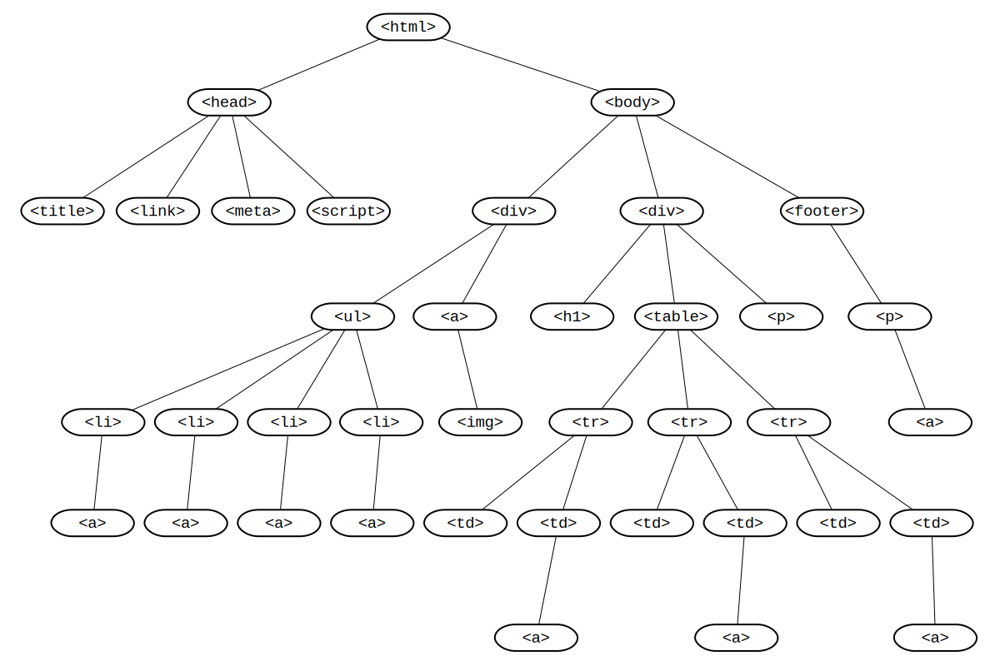

1. The webpage presents a UI for a user to interact with, which in turn is displayed via a "rendering engine". What is displayed by this "rendering engine" is outlined in the various html and css files associated with the page. The browser engine is utilized to connect the UI to the "rendering engine" along with any external servers. A browser must interact with a network (i.e. the internet) to obtain information displayed on the page like images as they are not typically stored locally and must be retrieved in order to display them. Javascript is the programming language that is utilized to perform any meaningful functionality on a website. It is able to utilize logic statements (functions, ifelse conditions, etc.) coupled with interaction of the webpage (and incoming inputs) to give out a desired result. A javascript interpreter must be used to actually interact with the webpage itself as the components of computers (and by extension browsers as they are hosted on computers) only exclusively understand binary and thus it must be converted to that. To make sure that information does not have to call to a server every single time you load a page, certain information (cookies, local data storage) will be rememebred to speed up said process.
    a. The rendering engine will first read the HTML file, create a DOM (content tree) based on the file then the css styling will be applied to the created DOM (this is the render tree). The elements are then laid out on the page based on their category in the HTML document and their specific positioning in the CSS document. Once complete you can finally interact with the page, making the javascript file able to be used now.

2. A DOM (document object model) is essentially a tree of your HTML file that lays out all elements in a sort of hierarchical order. This allows objects at lower hierarchical tiers to have specific traits applied to them (and all objects below them) and not objects in higher hierarchical tiers. This is especially useful for CSS formatting and JS referencing as it allows you to really zero in on specific objects you want to change or interact with. For example below you can see a hierarchy tree of all HTML tags:

3. HTML is mainly used to creating the page and its layout, with almost any website you interact on a day-to-day basis being HTML. Conversely, XML is almost exclusively used for data storage/transport, meaning that unlike HTML is will simply store data and assign "tags" to said data but will not make any webpage (useful for circumstances in which handling a lot of data is needed but website rendering is mostly static). XHTML is essentially just HTML and XML combined which allows it to be very cross-compatible across devices/browsers like in XML (unlike HTML) while also having all the same features that a normal HTML page has, the only downside being that the it is much more difficult to work with due to low leniency in terms of formatting (must spend much more time formatting code instead of writing it).

4. The 4 elements you need in your HTML page are <!DOCTYPE>, root, head, and body. DOCTYPE simply defines that this document is in fact an HTML or whatever document it is, rather than making it try to determine what is it. Root is just the container defining what what the section should be read as, for example html will obviously be read as HTML but script will be read as javascript and will execute things writen in that section as such. The head element is basically an area for metadata, routing information, or other features like title. Things you may typically see here would be calls to preload images, links to javascript and CSS files (so it knows which files it should interact with when their functions are called), and the title of your site (which appears as the words that run across the tab at the top of the page). The body element is where all your webpage elements are: headers, paragraph, body, buttons, etc.

5. The index.html file is basically the "master" HTML file, think of it like being at the top of the hierarchical tree. This is the homepage or starting index.html in which all other indices branch off from (different pages on a website). One needs a master index.html as you can't have a website without a homepage can you?

6. 